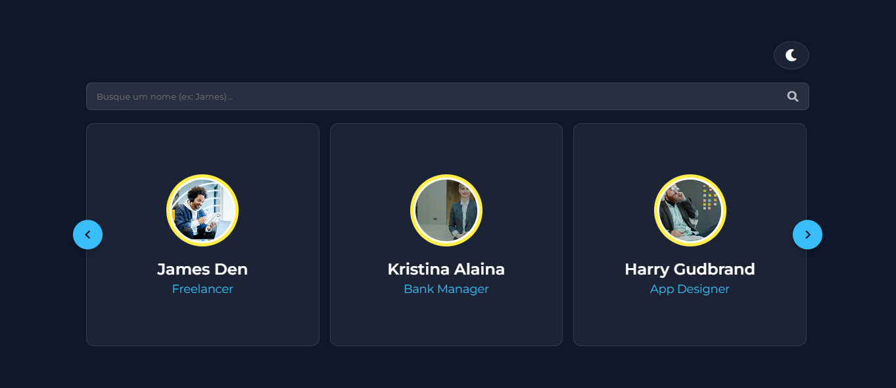
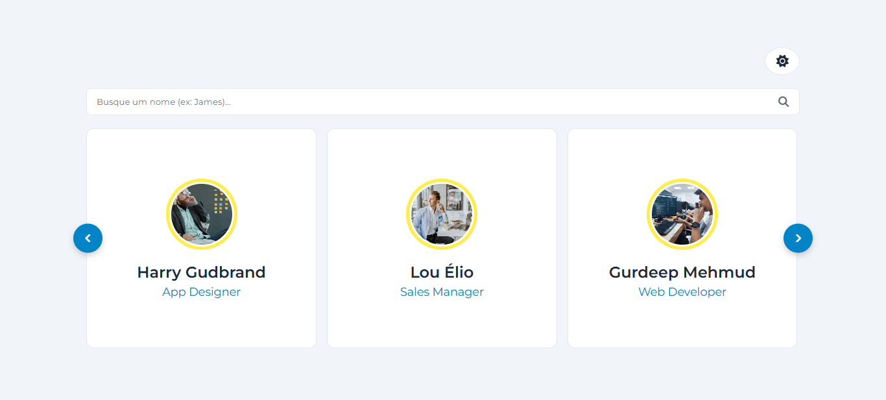

# 🎴 Modern Card Slider - Student/Career Edition

[](#)
[](#)
[](#)

Um carrossel de cards premium e ultra-responsivo, desenvolvido com foco em manipulação avançada de DOM, arquitetura de CSS moderno e experiência do usuário (UX). O projeto apresenta uma temática inspirada em um card selection de profissionais(imagens gratuitas do unsplash), demonstrando como alinhar design com funcionalidades robustas.

## 🚀 Demonstração




✨ **Acesse o projeto online:** [Card Slider Live](https://gustavodeoliveiradev.github.io/card-slider-js/)

---

## 💎 Funcionalidades Principais

* **🌓 Dark/Light Mode Persistente:** Alternância de temas via Variáveis CSS (`Custom Properties`) com memória de preferência do usuário salva no `localStorage`.
* **🔍 Filtro de Busca Dinâmico:** Sistema de busca em tempo real que filtra os cards por nome, desativando inteligentemente o loop infinito para garantir precisão nos resultados.
* **♾️ Seamless Infinite Scroll:** Lógica de clonagem dinâmica de elementos para um efeito de rolagem infinita sem interrupções.
* **🤖 Auto-play Inteligente:** Movimentação automática com sistema de pausa em `hover`, durante interações de arraste ou quando o filtro de busca está ativo.
* **🖱️ Drag-to-Scroll & Touch:** Suporte total para gestos em dispositivos móveis e interação via mouse no desktop, com cursor dinâmico (`grab/grabbing`).
* **🎨 Estética Glassmorphism:** Interface moderna utilizando `backdrop-filter`, transparências e bordas translúcidas que se adaptam ao tema escolhido.

---

## 🛠️ Tecnologias e Conceitos Utilizados

* **HTML5 Semântico**
* **CSS3 Avançado:** Flexbox, Grid, Variáveis CSS, Media Queries e Efeitos de Glassmorphism.
* **JavaScript Puro (Vanilla JS):**
    * Manipulação de DOM (Clonagem e inserção dinâmica).
    * Event Listeners para Mouse e Touch.
    * Lógica de temporizadores (`setInterval/clearInterval`).
    * Persistência de dados com `Web Storage API`.
    * Refatoração com Operadores Ternários e Funções Nomeadas.
* **FontAwesome:** Biblioteca de ícones.

---

## 📅 Diário de Evolução

Este projeto foi construído e refinado ao longo de 6 dias intensivos de estudo:

* **Dia 1:** Estrutura base e correção de bugs de rolagem.
* **Dia 2:** Implementação de layout Glassmorphism e lógica de Auto-play.
* **Dia 3:** Suporte a Drag/Touch e melhorias de UX (Prevenção de seleção de texto).
* **Dia 4:** Lógica de Infinite Loop real com clonagem de elementos e "teletransporte" de scroll.
* **Dia 5:** Filtro de Busca Dinâmico e refatoração da estrutura para suporte a filtros.
* **Dia 6:** Implementação de Dark/Light Mode, persistência com LocalStorage e refatoração completa do código para padrões profissionais.

---

## 🔧 Como Rodar o Projeto

1.  Clone este repositório:
    ```bash
    git clone [https://github.com/gustavodeoliveiradev/card-slider-js.git](https://github.com/gustavodeoliveiradev/card-slider-js.git)
    ```
2.  Abra o arquivo `index.html` no seu navegador de preferência ou utilize a extensão **Live Server** no VS Code.

---
Desenvolvido com ❤️ por [Gustavo de Oliveira](https://github.com/gustavodeoliveiradev) como parte de um estudo aprofundado em Front-end.